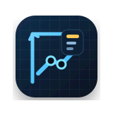
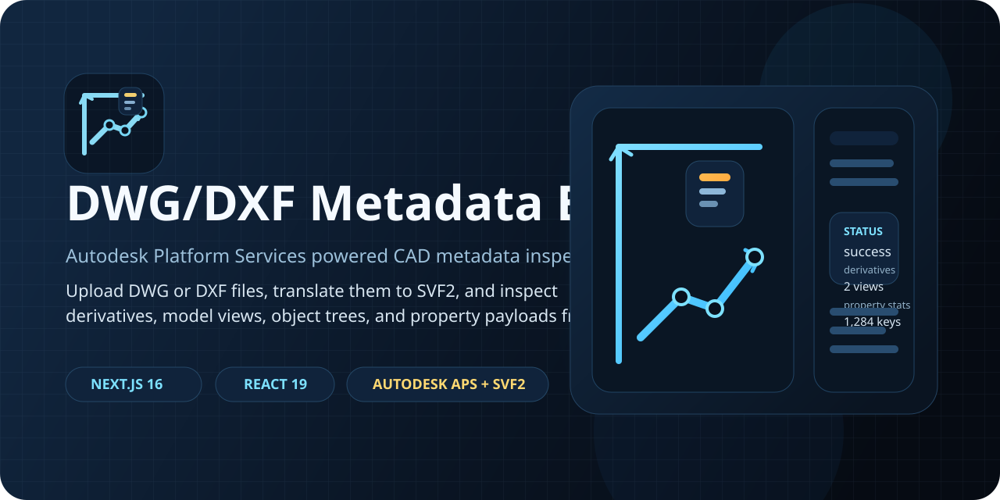

<p align="center">
  
</p>

<h1 align="center">DWG/DXF Metadata Extractor</h1>

<p align="center">
  Upload DWG and DXF files, translate them with Autodesk Platform Services, and inspect derivative, view, object tree, and property metadata from a clean Next.js interface.
</p>

<p align="center">
  <a href="https://github.com/pradhankukiran/dwg-dxf-metadata-extractor/stargazers">
    
  </a>
  <a href="https://github.com/pradhankukiran/dwg-dxf-metadata-extractor/network/members">
    
  </a>
  <a href="https://github.com/pradhankukiran/dwg-dxf-metadata-extractor/issues">
    
  </a>
  
</p>

<p align="center">
  
  
  
  
  
  
</p>

<p align="center">
  <a href="#highlights">Highlights</a> |
  <a href="#how-it-works">How It Works</a> |
  <a href="#quick-start">Quick Start</a> |
  <a href="#api">API</a> |
  <a href="#project-structure">Project Structure</a>
</p>

<p align="center">
  
</p>

## Highlights

- Accepts `.dwg` and `.dxf` uploads through drag-and-drop or file picker UI.
- Uploads files to Autodesk OSS, submits an SVF2 translation job, and polls APS until metadata is ready.
- Surfaces derivative resources, model views, object tree stats, and property stats in one place.
- Lets you switch between a formatted inspector and raw JSON output for deeper debugging.
- Runs on Next.js App Router with a server-side `POST /api/extract` workflow.
- Includes clear extraction status updates and APS error handling for failed jobs or long-running translations.

## Why This Repo Exists

Most CAD upload demos stop after a translation request succeeds. This project focuses on the part you usually need next: inspecting what APS actually produced. Instead of treating the Model Derivative API as a black box, it gives you a direct way to explore derivative metadata, view payloads, object trees, and property collections for DWG and DXF inputs.

## How It Works

```mermaid
flowchart LR
    A[Upload DWG or DXF] --> B[Next.js route handler]
    B --> C[Fetch two-legged APS token]
    C --> D[Ensure transient OSS bucket exists]
    D --> E[Upload file to Autodesk OSS]
    E --> F[Start SVF2 translation job]
    F --> G[Poll manifest until ready]
    G --> H[Collect derivatives and model views]
    H --> I[Fetch object tree and all properties]
    I --> J[Render formatted metadata and raw JSON]
```



## What Gets Extracted

- Translation status, progress, region, and thumbnail availability.
- Derivative output records including role, output type, and resource URNs.
- Model view descriptors with GUIDs, roles, URNs, and viewable IDs.
- Object tree node counts and depth stats when the APS object tree is available.
- Property collection counts for objects, categories, and total properties.
- File lineage data such as original filename, source URN, bucket key, and object key.

## Tech Stack

| Layer | Tools |
| --- | --- |
| App framework | Next.js 16, React 19, TypeScript |
| CAD processing | Autodesk Platform Services Authentication, OSS, Model Derivative SDKs |
| UI | Tailwind CSS 4, Radix UI primitives, shadcn-style components, Lucide icons |
| Analytics | Vercel Analytics |
| Runtime | Node.js route handler on the Next.js App Router |
| Package manager | pnpm |

## Quick Start

### Prerequisites

- Node.js `20.9+`
- `pnpm` installed locally
- Autodesk Platform Services credentials with access to OSS and Model Derivative APIs

### Installation

```bash
git clone https://github.com/pradhankukiran/dwg-dxf-metadata-extractor.git
cd dwg-dxf-metadata-extractor
pnpm install
cp .env.example .env.local
```

Then fill in `.env.local`:

```bash
APS_CLIENT_ID=your_aps_client_id
APS_CLIENT_SECRET=your_aps_client_secret
```

Start the app:

```bash
pnpm dev
```

Open `http://localhost:3000`.

## Environment Variables

| Variable | Required | Description |
| --- | --- | --- |
| `APS_CLIENT_ID` | Yes | Autodesk Platform Services client ID used for two-legged auth |
| `APS_CLIENT_SECRET` | Yes | Autodesk Platform Services client secret used for token exchange |

## API

### `POST /api/extract`

Uploads a DWG or DXF file, submits it to APS for translation, waits for metadata availability, and returns a metadata envelope.

Example request:

```bash
curl -X POST http://localhost:3000/api/extract \
  -F "file=@./sample.dwg"
```

Example response shape:

```json
{
  "metadata": {
    "status": "success",
    "progress": "complete",
    "region": "US",
    "derivatives": [],
    "modelViews": [],
    "originalFileName": "sample.dwg",
    "sourceUrn": "dXJuOmFkc2sub2JqZWN0czpvcy5vYmplY3Q6Li4u",
    "translationUrn": "dXJuOmFkc2sub2JqZWN0czpvcy5vYmplY3Q6Li4u",
    "bucketKey": "dwg-extractor-bucket",
    "objectKey": "1712345678901-sample.dwg"
  }
}
```

### Operational Notes

- The route uses the Node.js runtime and allows up to `300` seconds for large files.
- The OSS bucket is created with the `transient` policy.
- Metadata polling waits for the translation manifest before requesting object trees and properties.
- Object tree and property enrichment are best-effort; the base manifest can still succeed even if those secondary calls are unavailable.

## Project Structure

```text
app/
  api/extract/route.ts     # APS auth, OSS upload, translation polling, metadata aggregation
  layout.tsx               # App metadata and global shell
  page.tsx                 # Upload flow and extraction state management
components/
  file-upload.tsx          # Drag-and-drop and file picker input
  metadata-display.tsx     # Formatted metadata inspector and raw JSON view
  ui/                      # Reusable UI primitives
lib/
  utils.ts                 # Shared utility helpers
public/
  favicon.svg              # App favicon
```

## Local Development Notes

- The repository uses `pnpm` as the source-of-truth package manager.
- Next.js 16 is currently configured with the App Router and a Node.js route handler for extraction.
- `tsconfig.json` includes `.next/dev/types/**/*.ts`, which matches current Next.js development type generation.

## Limitations

- APS credentials are required even for local development.
- Only DWG and DXF uploads are accepted by the current UI.
- Large or complex files can still exceed Autodesk processing time, in which case the API returns a timeout error.
- The app focuses on metadata inspection, not inline CAD rendering.

## Contributing

Issues and pull requests are welcome when they improve extraction reliability, metadata coverage, DXF compatibility, or the inspection UI.
